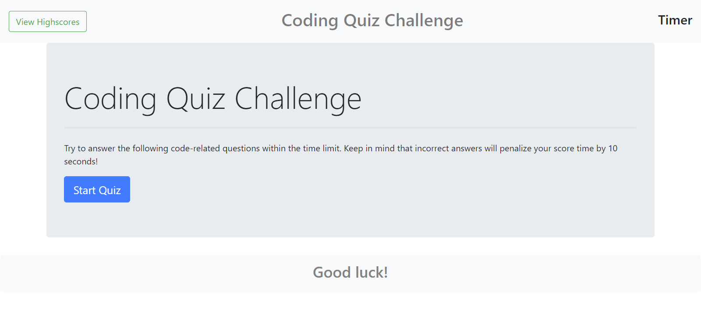

# Code-Quiz
Module 4 Challenge: Code- Quiz
by Sergey Holin

GitHub Repo Link: https://github.com/sergeyholin/Code-Quiz

Live Application Link: https://sergeyholin.github.io/Code-Quiz/

NOTES: I ran into a problem with this challenge. Everything works fine up until question 2, then timer and score points are starting to act weird. On questions 2-5 my app deducts points and time on all answers right and wrong, thus making it impossible to properly count points and correctly deduct time. I tested this extensively for days, it seems that as you progress through the test past question 1, my app links all the buttons from previous answers together, thus choosing correct answer in questions 2-5 still deducts time and points. I've tried everything: return function, prevent default, stop propogation commands, nothing seems to stop this behavior. I reached out to ask BCS and they couldn't help me ether. So after countless hours of trying to figure it out i chose to move on, because i have other projects to complete. Maybe in the future i'll learn something that wil allow me to come back and fix this problem.

1) ACCEPTANCE CRITERIA:

GIVEN I am taking a code quiz
WHEN I click the start button
THEN a timer starts and I am presented with a question
WHEN I answer a question
THEN I am presented with another question
WHEN I answer a question incorrectly
THEN time is subtracted from the clock
WHEN all questions are answered or the timer reaches 0
THEN the game is over
WHEN the game is over
THEN I can save my initials and my score

2) ADDITIONAL CRITERIA:

Application deployed at live URL.

3) SCREENSHOT:

